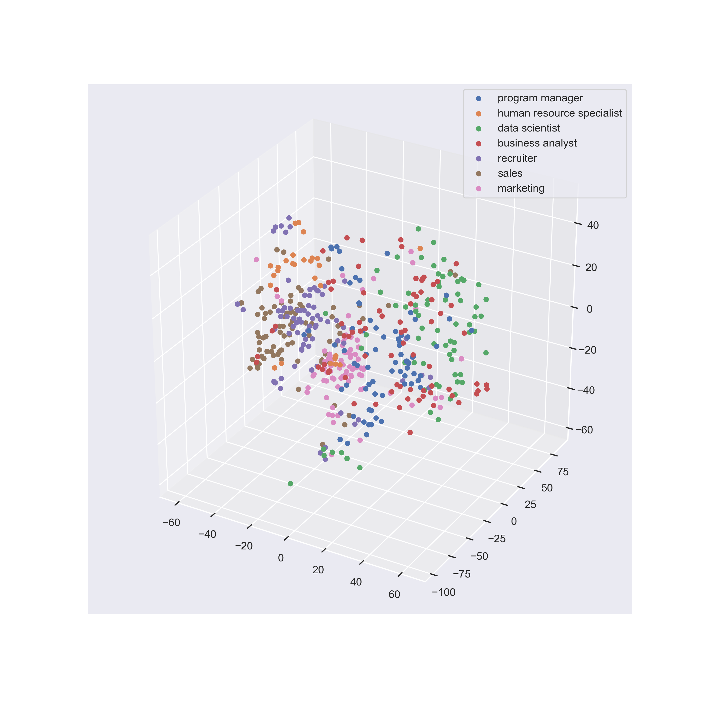

# NLP job description
## Overview
Perform analysis, visualization and machine learning prediction on over 2000 job descriptions.

## Processing & Visualziation
In notebook "NLP_exploration_visualization.ipynb", I explore the data using regular expression to discover certain keyword or patterns in job descriptions for a specific job. Then I preprocessed the data using common NLP techniques (tokenization, stemming, lemmatization, etc.). Finally, I used dimensionality reduction technique t-SNE to reduce the data to 3 dimensions and make visualization to gain insights into different kinds of jobs.

## Machine Learning
In "NLP_ML_classification.ipynb", I tried to classify job descriptions with several ML methods.
